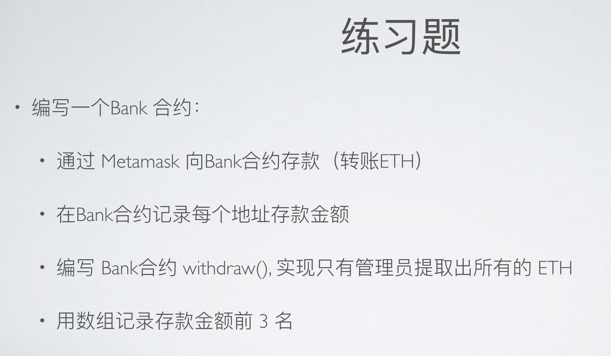
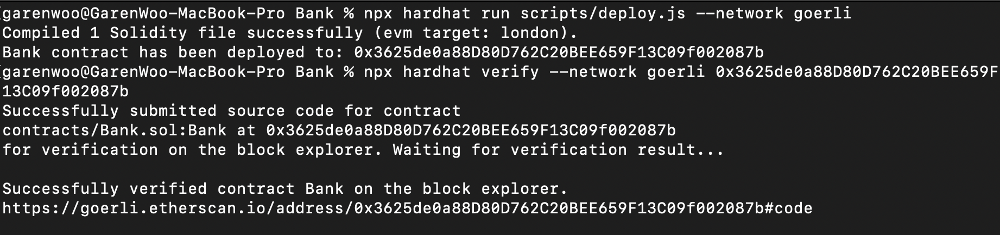
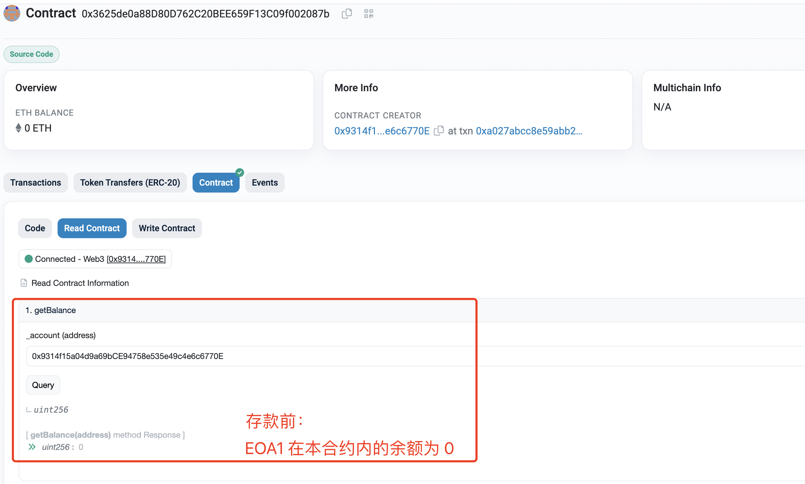
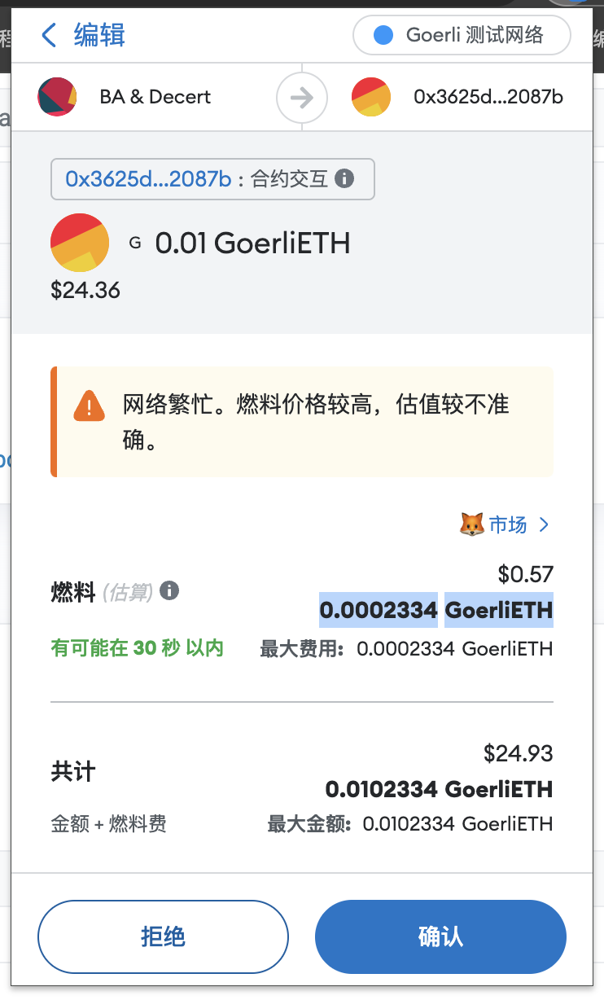
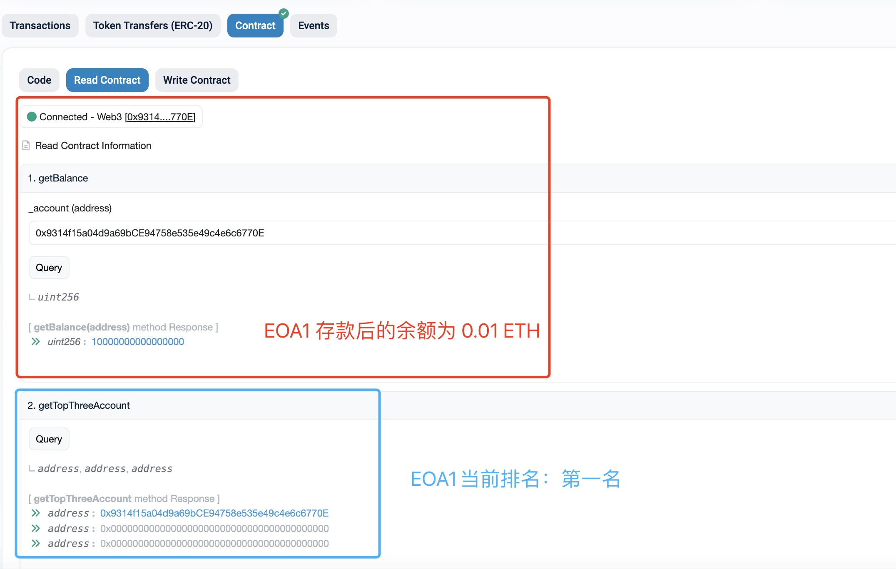
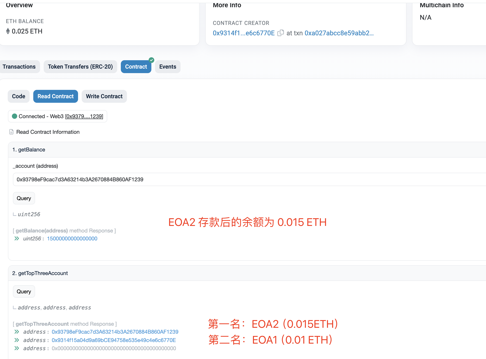
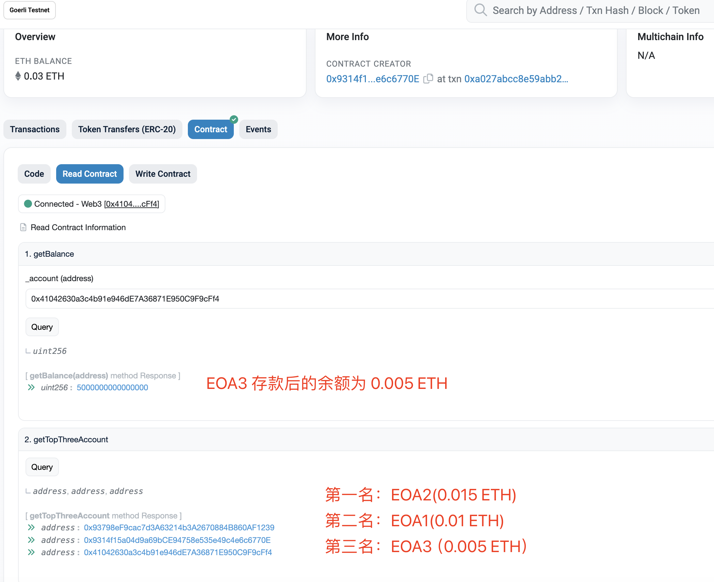
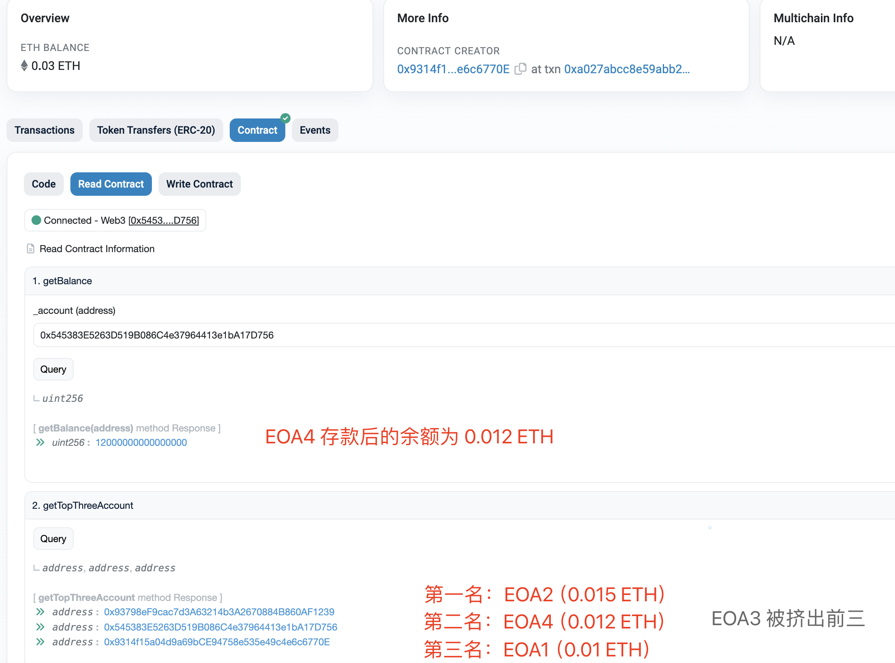
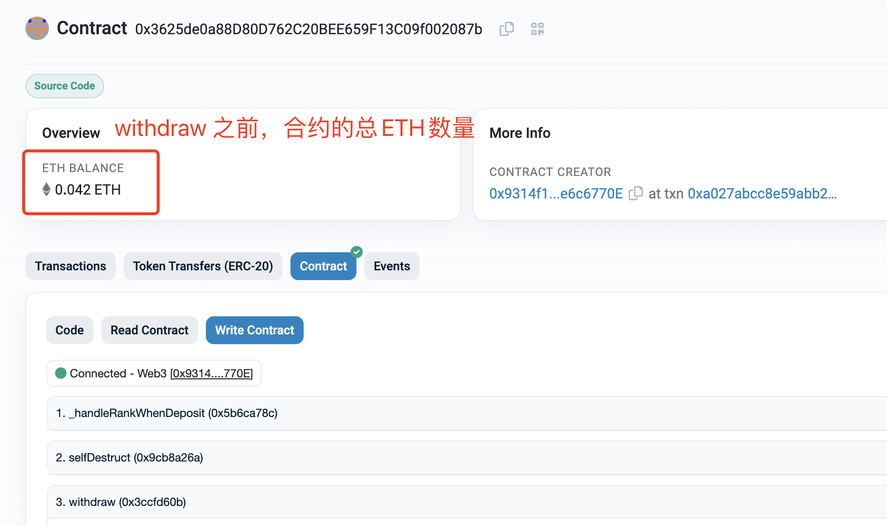
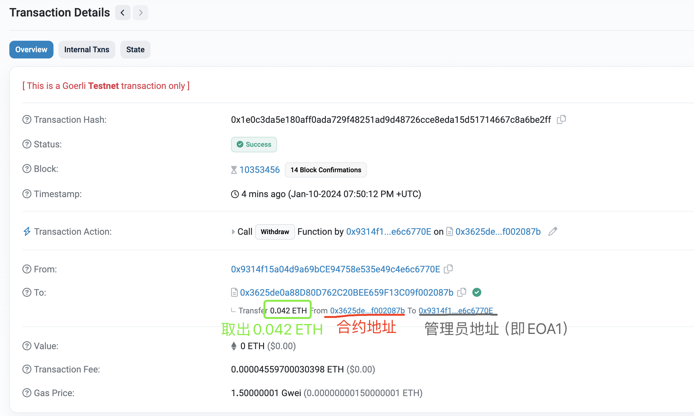

# 练习题（01.10）




## 编写⼀个Bank 合约

```solidity
// SPDX-License-Identifier: MIT
pragma solidity ^0.8.0;

contract Bank {
    // To protect personal privacy, some of the variables are set internal.
    // To get those values of variables, set getter-functions to get users' values by their own instead of being queried by anyone.
    mapping(address => uint) internal balance;
    address[3] internal rank;
    address public owner;

    constructor() {
        owner = msg.sender;
    }

    modifier onlyOwner() {
        require(msg.sender == owner, "Only owner can call");
        _;
    }

    receive() external payable {
        balance[msg.sender] += msg.value;
        _handleRankWhenDeposit();
    }

    function withdraw() public onlyOwner {
        payable(owner).transfer(address(this).balance);
    }

    function selfDestruct() external onlyOwner {
        selfdestruct(payable(owner));
    }

    function getBalance(address _account) public view returns (uint) {
        return balance[_account];
    }

    function getTopThreeAccount()
        public
        view
        returns (address, address, address)
    {
        return (rank[0], rank[1], rank[2]);
    }

    function _handleRankWhenDeposit() internal {
        uint membershipIndex = _checkRankMembership();
        uint convertedIndex;
        uint indexRecord = 777;
        if (membershipIndex != 999) {
            // Case 1: msg.sender is already inside the top3 rank.
            convertedIndex = membershipIndex + 4;
            for (uint i = convertedIndex - 3; i > 1; i--) {
                if (membershipIndex != 0) {
                    if (balance[msg.sender] >= balance[rank[i - 2]]) {
                        indexRecord = i - 2;
                        for (uint j = 2; j > i - 2; j--) {
                            rank[j] = rank[j - 1];
                        }
                        // Boundry condition
                        if (indexRecord == 0) {
                            rank[indexRecord] = msg.sender;
                        }
                    } else {
                        if (indexRecord != 777) {
                            rank[indexRecord] = msg.sender;
                        }
                    }
                }
            }
        } else {
            // Case 2: msg.sender is not inside the top3 rank.
            for (uint i = 3; i > 0; i--) {
                if (balance[msg.sender] >= balance[rank[i - 1]]) {
                    indexRecord = i - 1;
                    // move backward the element(s) which is(/are) right at the index and also behind the index
                    for (uint j = 2; j > i - 1; j--) {
                        rank[j] = rank[j - 1];
                    }
                    // Boundry condition
                    if (indexRecord == 0) {
                        rank[indexRecord] = msg.sender;
                    }
                } else {
                    if (indexRecord != 777) {
                        rank[indexRecord] = msg.sender;
                    }
                }
            }
        }
    }

    function _checkRankMembership() internal view returns (uint) {
        uint index = 999;
        for (uint i = 0; i < 3; i++) {
            if (rank[i] == msg.sender) {
                index = i;
                break;
            }
        }
        return index;
    }
}
```



**合约已部署在 Ethereal Goerli Testnet，已开源，合约 URL ：**
https://goerli.etherscan.io/address/0x3625de0a88D80D762C20BEE659F13C09f002087b#code

## 1. 通过 Metamask 向 Bank 合约存款（转账 ETH ），在Bank合约记录每个地址存款⾦额，⽤数组记录存款⾦额前 3 名

**合约账户地址**：0x3625de0a88D80D762C20BEE659F13C09f002087b

**EOA1 地址**：0x9314f15a04d9a69bCE94758e535e49c4e6c6770E

### (1-1). 转账前 EOA1 的余额：



### (1-2). 使用 EOA1 向合约账户转入 0.01 ETH：



**EOA1 向合约账户存入 0.01 ETH，交易 URL：**
https://goerli.etherscan.io/tx/0x2d3052e4d29a5e00d0e5078cfb0c23d8ad3d51b5ee2167aa1e82bc278966dcbe

### (1-3). EOA1 的余额更新为 0.01 ETH：



### (2). 同理，依次使用 EOA2、EOA3、EOA4 向该合约分别转入 0.015 ETH 、 0.005 ETH 和 0.012 ETH

**EOA2 地址**：0x93798eF9cac7d3A63214b3A2670884B860AF1239

**EOA2 转入 0.015 ETH 交易**：
https://goerli.etherscan.io/tx/0x03c07e26e2b3968a968a3cd562e98aadd7c1d7047bcaa12137313e2fe17344cf



**EOA3 地址**：0x41042630a3c4b91e946dE7A36871E950C9F9cFf4

**EOA3 转入 0.005 ETH 交易**：
https://goerli.etherscan.io/tx/0x22d5572da5c7be35fd12937b5b579eb067bda7c3e536eff4662c3880608d4839



**EOA4 地址**：0x545383E5263D519B086C4e37964413e1bA17D756

**EOA4 转入 0.012 ETH 交易**：
https://goerli.etherscan.io/tx/0xc56a8b723c2461c6322f81469c811eca0adc455b365a66732f6df1b8278731dc



## 编写 Bank合约 withdraw(), 实现只有管理员提取出所有的 ETH

### 实现此功能的代码片段如下：

```
// SPDX-License-Identifier: MIT
pragma solidity ^0.8.0;

contract Bank {
		// 之前的代码省略
    address public owner;
    
    // 无关语句省略

    modifier onlyOwner() {
        require(msg.sender == owner, "Only owner can call");
        _;
    }

    function withdraw() public onlyOwner {
        payable(owner).transfer(address(this).balance);
    }
    // 其后的代码省略
}
```

**管理员地址（同 EOA1）**：0x9314f15a04d9a69bCE94758e535e49c4e6c6770E

**合约中 ETH 余额为 0.042 ETH**：



**提出所有 ETH 的交易**：
https://goerli.etherscan.io/tx/0x1e0c3da5e180aff0ada729f48251ad9d48726cce8eda15d51714667c8a6be2ff


